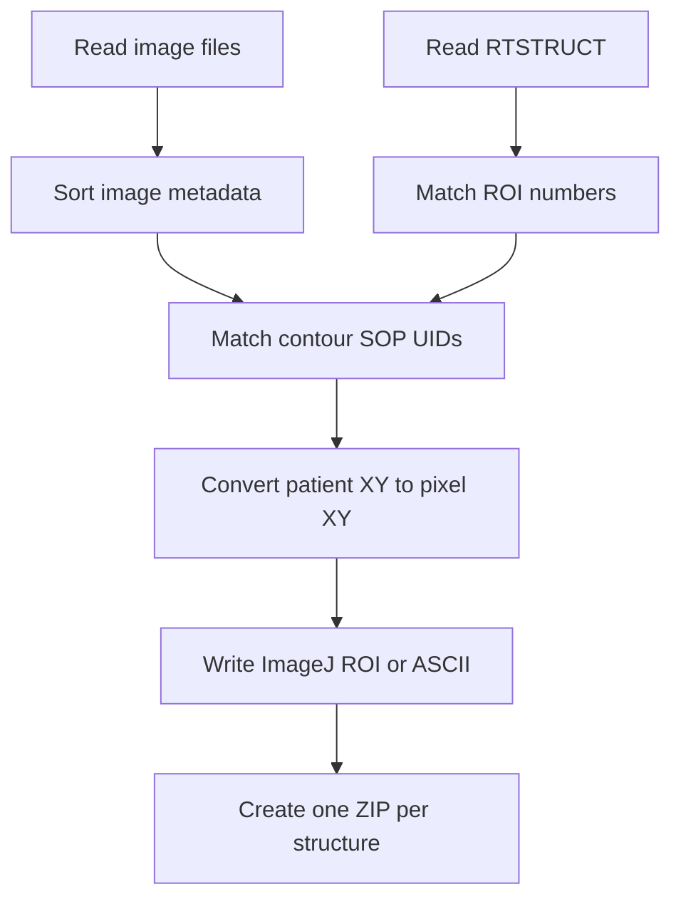

# RTSTRUCT to ImageJ ROI Converter for MATLAB

MATLAB utility for reading a DICOM RT Structure Set and its referenced image series, matching contours to image slices by SOP Instance UID, converting contour coordinates to ImageJ pixel coordinates, and exporting ImageJ ROI ZIP files, ASCII coordinate files, or both.

> [!CAUTION]
> This script is a research and quality-assurance utility, not a validated clinical conversion system. The current coordinate transform is suitable only for a restricted image geometry and does not use DICOM image orientation direction cosines. Validate every exported contour against the source RTSTRUCT and images before quantitative or clinical use.

## Table of contents

- [Overview](#overview)
- [Repository file](#repository-file)
- [Requirements](#requirements)
- [Installation](#installation)
- [Quick start](#quick-start)
- [Function interface](#function-interface)
- [Input requirements](#input-requirements)
- [Output files](#output-files)
- [How the conversion works](#how-the-conversion-works)
- [MATLAB return values](#matlab-return-values)
- [DICOM geometry assumptions](#dicom-geometry-assumptions)
- [ImageJ stack alignment](#imagej-stack-alignment)
- [Important limitations](#important-limitations)
- [Validation workflow](#validation-workflow)
- [Troubleshooting](#troubleshooting)
- [Suggested improvements](#suggested-improvements)
- [Privacy and clinical safety](#privacy-and-clinical-safety)
- [References](#references)
- [License](#license)

## Overview

The primary MATLAB function is declared as:

```matlab
function [roi, dcmrt, dcm] = rtstruct2imagejroi( ...
    rtstructfile, dicomdir, outdir, savetype)
```

The script performs the following operations:

- Opens an RTSTRUCT and a directory of referenced DICOM images.
- Reads and rescale-converts the image pixels to `double`.
- Sorts the images by `InstanceNumber`, with a fallback to descending patient `z` position.
- Verifies that the RTSTRUCT ROI definitions reference the same Frame of Reference UID as the first image.
- Matches every contour to an image using `ReferencedSOPInstanceUID`.
- Reshapes DICOM `ContourData` triplets into patient-coordinate points.
- Converts patient `x,y` coordinates to approximate image pixel coordinates.
- Creates ImageJ polygon ROIs using ImageJ 1.x Java classes.
- Assigns each ImageJ ROI to a stack slice position.
- Packages the ImageJ ROI files into one ZIP archive per structure.
- Optionally writes plain-text pixel-coordinate files.
- Returns the parsed RTSTRUCT metadata and loaded image-series information.

The script does not create masks, calculate areas or volumes, interpolate missing slices, rasterize contours, repair contour topology, or compare the exported ROIs against a reference segmentation.

## Repository file

| File | Purpose |
|---|---|
| `JSRTStruct2roi.m` | RTSTRUCT reader, DICOM series loader, contour-to-slice matcher, coordinate converter, ImageJ ROI writer, and ASCII exporter. |
| `README_JSRTStruct2roi.md` | This GitHub usage and technical guide. It may be renamed to `README.md` if the converter is the repository's main project. |

### MATLAB filename and function name

The attached file is named `JSRTStruct2roi.m`, but its first function is named `rtstruct2imagejroi`. MATLAB associates a primary function with its filename, and the names should match.

Use one of these approaches before running the code:

1. Rename the file to `rtstruct2imagejroi.m` and use the examples in this guide; or
2. Change the first function declaration to `JSRTStruct2roi` and call that name instead.

Renaming the file to `rtstruct2imagejroi.m` is the least invasive option because it preserves the function declaration and its existing help text.

## Requirements

- MATLAB with Java support and a graphical desktop for interactive file selection.
- Image Processing Toolbox for `dicominfo` and `dicomread`.
- ImageJ 1.x classes supplied in `ij.jar` or a versioned `ij-*.jar` from Fiji/ImageJ.
- A classic single-frame DICOM CT-like image series stored as individual `.dcm` files.
- An RTSTRUCT that references the selected image instances through `ContourImageSequence`.
- A writable output directory.

No Miji installation is required. The script calls ImageJ Java classes directly:

```text
ij.process.FloatPolygon
ij.gui.PolygonRoi
ij.io.RoiEncoder
```

### MATLAB release

The code does not declare a minimum tested release. Use a MATLAB release that supports the specified `dicominfo` options and Java integration. MATLAB R2020a or newer also provides the built-in `dicomContours` object, which can be useful for independently validating RTSTRUCT parsing.

### Platform notes

- On Windows, validate ROI names because some DICOM structure names contain characters that are invalid in folder or file names.
- On macOS and Linux, filename matching for `*.dcm` is case-sensitive on common filesystems; uppercase `.DCM` files may not be found.
- MATLAB Online or a no-JVM/headless session may not support the required ImageJ Java workflow.

## Installation

### 1. Prepare the MATLAB function

Rename the supplied file so that the filename matches the primary function:

```text
JSRTStruct2roi.m  ->  rtstruct2imagejroi.m
```

Place it in the MATLAB Current Folder or add its directory to the MATLAB path:

```matlab
addpath('C:\path\to\rtstruct-converter')
```

### 2. Add ImageJ to the Java class path

Add the exact path to the ImageJ JAR for the current MATLAB session:

```matlab
javaaddpath('C:\path\to\ImageJ\ij.jar')
```

For Fiji, the JAR is normally located in the Fiji `jars` directory and may have a versioned filename. Pass the exact JAR path; do not use a wildcard.

Confirm that the classes are available:

```matlab
methods('ij.io.RoiEncoder')
methods('ij.gui.PolygonRoi')
```

If MATLAB reports that the class cannot be found, inspect the current Java path:

```matlab
javaclasspath
```

For repeated use, add the JAR to MATLAB's static Java class path or run `javaaddpath` from `startup.m`. Restart MATLAB after changing the static Java path.

### 3. Prepare the DICOM directory

Use a dedicated folder containing only the referenced image series:

- One classic single-frame image per file.
- Lowercase `.dcm` extension.
- One `SeriesInstanceUID` and one `FrameOfReferenceUID`.
- Consistent rows, columns, pixel spacing, orientation, and rescale fields.
- Do not place the RTSTRUCT in the image directory.

## Quick start

### Interactive mode

Call the function without arguments:

```matlab
[roi, dcmrt, dcm] = rtstruct2imagejroi;
```

The application prompts for:

1. The RTSTRUCT `.dcm` file.
2. The directory containing the referenced image slices.
3. The output directory.

Interactive mode always uses:

```matlab
savetype = 'imagej';
```

It does not ask whether ASCII or combined output is wanted.

### Programmatic mode

```matlab
rtstructFile = 'C:\data\patient01\RS.1.2.840....dcm';
imageDir    = 'C:\data\patient01\CT';
outputDir   = 'C:\data\patient01\exported_rois';

[roi, dcmrt, dcm] = rtstruct2imagejroi( ...
    rtstructFile, imageDir, outputDir, 'both');
```

Valid `savetype` values are case-insensitive:

| Value | Output |
|---|---|
| `'imagej'` | One ImageJ ROI ZIP archive per structure. |
| `'ascii'` | One two-column text file per contour polygon. |
| `'both'` | ImageJ ZIP and ASCII output. |

The code does not explicitly reject another value. An unsupported value can complete without producing contour files, so validate it before calling the function.

The function supports either zero arguments or all four arguments. Calls with only one, two, or three inputs are not handled and can fail because missing variables are not assigned default values.

## Function interface

```matlab
[roi, dcmrt, dcm] = rtstruct2imagejroi( ...
    rtstructfile, dicomdir, outdir, savetype)
```

### Inputs

| Input | Type | Description |
|---|---|---|
| `rtstructfile` | Character vector or compatible text scalar | Full path to the DICOM RT Structure Set. |
| `dicomdir` | Character vector or compatible text scalar | Directory containing referenced DICOM image slices. Only lowercase `*.dcm` files are scanned. |
| `outdir` | Character vector or compatible text scalar | Parent directory for the generated `contours` and temporary `tmp_roi` folders. |
| `savetype` | Text | `'imagej'`, `'ascii'`, or `'both'`. |

### Outputs

| Output | Description |
|---|---|
| `roi` | Structure array containing ROI name, ROI number, and matched sorted-slice indices. Despite the function header comment, patient/pixel contour coordinates are not returned by the current implementation. |
| `dcmrt` | Metadata structure returned by `dicominfo` for the RTSTRUCT. |
| `dcm` | Loaded and sorted image volume, per-slice DICOM metadata, and coordinate helper arrays. |

## Input requirements

### RTSTRUCT requirements

The RTSTRUCT must include:

- `Modality = RTSTRUCT`.
- `StructureSetROISequence`.
- `ROIContourSequence`.
- A `ReferencedFrameOfReferenceUID` for each structure definition.
- `ReferencedROINumber` links between the two sequences.
- `ContourSequence` for structures that contain contours.
- `ContourData` encoded as numeric values or parseable text.
- `ContourImageSequence.Item_1.ReferencedSOPInstanceUID` for every contour.

The code does not use the RT Referenced Series Sequence to identify the correct image series. The caller must provide the correct directory.

### Image-series requirements

The image directory is expected to contain:

- Only files matching `*.dcm`.
- Readable pixel data in every selected file.
- A valid `FrameOfReferenceUID`.
- `SOPInstanceUID` on every slice.
- `ImagePositionPatient` and `PixelSpacing`.
- `Width`, `Height`, and preferably `InstanceNumber`.
- `RescaleSlope` and `RescaleIntercept`, because the function always requests intensity-to-HU-style conversion.

The code description mentions CT/MRI images, but the current loader directly reads `RescaleSlope` and `RescaleIntercept`. Many MR objects do not provide these attributes, so unmodified use is primarily suitable for CT-like series that contain them.

### Directory restrictions

The reader is non-recursive and does not perform DICOM discovery. It ignores:

- Extensionless DICOM files.
- Files with an uppercase `.DCM` extension on case-sensitive systems.
- Files in nested folders.
- DICOMweb or PACS sources.
- A DICOMDIR index.

Do not include an RTSTRUCT or another non-image DICOM object in `dicomdir`. The function calls `dicomread` before checking `Modality`, so an RTSTRUCT without Pixel Data can fail before the later skip condition is reached.

## Output files

All persistent output is placed under:

```text
<outdir>/contours/
```

### ImageJ output

For an ROI named `Parotid_L`, the expected archive is:

```text
<outdir>/contours/Parotid_L.zip
```

The archive contains files such as:

```text
Parotid_L_0012.roi
Parotid_L_0013.roi
Parotid_L_0014.roi
```

The four-digit number is the slice's position in the **sorted MATLAB image array**, not necessarily its original DICOM `InstanceNumber`.

Each ImageJ object is a polygon ROI with:

```matlab
roislice.setPosition(sliceNum)
```

The temporary ImageJ files are written to:

```text
<outdir>/tmp_roi/
```

The folder is deleted after a successful ZIP operation for each structure.

### ASCII output

For the same structure, text files are written to:

```text
<outdir>/contours/Parotid_L/roi_<ROINumber>_<ContourIndex>.txt
```

Each file contains two columns:

```text
pixel_x    pixel_y
```

These are calculated pixel coordinates, not DICOM patient coordinates in millimetres. The filename contains the contour index but not the matched slice index; use `roi(k).sliceNumbers` or the source `ContourImageSequence` to recover the slice association.

### Output layout

| Save type | Structure ZIP | Structure folder | Temporary folder |
|---|---:|---:|---:|
| `imagej` | Yes | No | Created and deleted |
| `ascii` | No | Yes | Not created |
| `both` | Yes | Yes | Created and deleted |

ROI names are used directly in filenames and directory names. They are not sanitized, made unique, or truncated.

## How the conversion works



### 1. Read and sort the image series

For every lowercase `.dcm` file, the script reads:

```matlab
img  = double(dicomread(filename));
info = dicominfo(filename);
```

The pixels are rescaled with:

```matlab
img = img * double(info.RescaleSlope) ...
          + double(info.RescaleIntercept);
```

Values below `RescaleIntercept` are clamped to `RescaleIntercept`.

The series is sorted by ascending `InstanceNumber` when that field can be read for the series. If this fails, it sorts by descending `ImagePositionPatient(3)`.

### 2. Read and validate the RTSTRUCT

The RTSTRUCT is read with:

```matlab
dcmrt = dicominfo(rtstructfile, ...
    'UseVRHeuristic', false, ...
    'UseDictionaryVR', true);
```

The script checks:

- `Modality` is `RTSTRUCT`.
- `StructureSetROISequence` exists.
- `ROIContourSequence` exists.
- Each structure's referenced Frame of Reference UID equals the first image's Frame of Reference UID.

The complete `StructureSetROISequence` is printed to the Command Window for debugging, which can be verbose and may expose structure names or other metadata in captured logs.

### 3. Link definitions and contour data

For each structure definition:

1. Read `ROIName` and `ROINumber`.
2. Search the entire `ROIContourSequence` for the same `ReferencedROINumber`.
3. Read its `ContourSequence`.
4. For each contour, read the first `ReferencedSOPInstanceUID` in `ContourImageSequence`.
5. Find the same SOP Instance UID in the sorted image metadata.
6. Store the resulting sorted-array index as the ImageJ slice position.

An unmatched UID is reported to the Command Window, but the corresponding slice number remains `0` and conversion continues.

### 4. Decode contour points

DICOM contour data are expected as repeating patient-coordinate triples:

```text
x1 y1 z1 x2 y2 z2 ... xN yN zN
```

The script reshapes these to an `N x 3` matrix and retains the first two columns for export conversion.

### 5. Convert to pixel coordinates

The implemented transform is:

```matlab
px = (patientX - firstSlicePositionX) / firstPixelSpacing;
py = (patientY - firstSlicePositionY) / secondPixelSpacing;
```

No `+1` MATLAB indexing offset is added. The resulting coordinates are passed directly to ImageJ's `FloatPolygon`.

### 6. Write ROI files

ImageJ output is constructed as:

```matlab
xy = ij.process.FloatPolygon(px, py);
roislice = ij.gui.PolygonRoi(xy, ij.gui.PolygonRoi.POLYGON);
roislice.setPosition(sliceNum);
```

`ij.io.RoiEncoder` writes the `.roi` file. After all contours for one structure have been processed, MATLAB's `zip` function packages every temporary `.roi` file into a structure-specific archive.

## MATLAB return values

### `roi`

The returned structure normally contains:

| Field | Meaning |
|---|---|
| `name` | DICOM `ROIName`. |
| `id` | DICOM `ROINumber`. |
| `sliceNumbers` | Sorted image-array index assigned to each contour. Zero means no SOP Instance UID match. |

The main help comment says that `roi` contains contour `x,y` coordinates. The helper assigns `roi.data{l}` internally, but `extractContours` does not return its modified local `roi` value. Under MATLAB function argument semantics, those coordinates do not propagate to the caller. Therefore, do not expect `roi(k).data` from the current implementation.

### `dcmrt`

Full RTSTRUCT metadata returned by `dicominfo`, including the structure and contour sequences.

### `dcm`

| Field | Meaning |
|---|---|
| `img` | Sorted three-dimensional image volume stored as `double` after rescaling. |
| `info` | Sorted per-slice DICOM metadata structure array. |
| `x` | Approximate patient-x grid constructed from the first image position and spacing. Not used in ROI export. |
| `y` | Approximate patient-y grid constructed from the first image position and spacing. Not used in ROI export. |
| `z` | Per-slice `ImagePositionPatient(3)` after sorting. |

`UseInstanceNumber` is generated by the internal reader but is not returned by the primary function and does not affect later reporting.

## DICOM geometry assumptions

The DICOM Image Plane Module defines image position together with image orientation and pixel spacing. A general patient-to-pixel conversion requires the row and column direction cosines from `ImageOrientationPatient`.

The current script does not read or apply `ImageOrientationPatient`. It uses only:

- `ImagePositionPatient(1:2)` from the first sorted image.
- `PixelSpacing(1:2)` from the first sorted image.
- SOP Instance UID to determine slice position.

This approximation is only reasonable when all of these are true:

- The series is axial and not oblique.
- Patient x aligns with image x and patient y aligns with image y.
- Every slice has the same origin in x and y.
- Every slice has identical pixel spacing and matrix dimensions.
- The ImageJ stack uses the same in-plane orientation and is not flipped or rotated.
- Pixel spacing is square, or the row/column spacing mapping has been independently verified.

### Pixel spacing order

DICOM `PixelSpacing` stores row spacing first and column spacing second. ImageJ `x` normally corresponds to the column direction and `y` to the row direction. The current code divides patient x by `PixelSpacing(1)` and patient y by `PixelSpacing(2)`. With square pixels this has no numerical effect; with unequal row and column spacing it can apply the spacing components in the wrong direction.

### Unsupported geometry

Do not use the current transform without modification for:

- Oblique CT or MR.
- Sagittal or coronal series.
- Images with gantry tilt.
- Rotated, flipped, or reoriented ImageJ stacks.
- Enhanced multi-frame objects.
- Mixed series or mixed Frame of Reference UIDs.
- Nonuniform in-plane geometry.

For robust conversion, calculate pixel coordinates using the full DICOM affine transform from `ImagePositionPatient`, `ImageOrientationPatient`, and the row/column values of `PixelSpacing` for the matched slice.

## ImageJ stack alignment

An ImageJ ROI position is assigned from the index of the referenced SOP Instance UID in `dcm.info` **after MATLAB sorting**.

This is not guaranteed to equal:

- DICOM `InstanceNumber`.
- A filename's numeric suffix.
- The order chosen by ImageJ when importing a folder.
- An anatomical superior-to-inferior or inferior-to-superior order.

To overlay the ZIP correctly, the ImageJ stack must use exactly the same slice order as `dcm.info`.

Recommended verification:

1. Record `dcm.info(k).SOPInstanceUID` and `dcm.info(k).InstanceNumber` for several slices.
2. Confirm the first, middle, and last images in ImageJ correspond to the same SOP Instance UIDs or positions.
3. Load the ROI ZIP with ImageJ's ROI Manager.
4. Check structures on multiple superior, central, and inferior slices.
5. Confirm left/right, anterior/posterior, and superior/inferior orientation.

If a referenced SOP Instance UID is not found, the script leaves the slice position as zero. In ImageJ, a zero-position ROI may not behave as a correctly slice-bound ROI and must be treated as an error, not as a valid match.

## Important limitations

| Priority | Behavior or limitation | Consequence | Recommended mitigation |
|---|---|---|---|
| High | Filename `JSRTStruct2roi.m` does not match primary function `rtstruct2imagejroi`. | Calling and help lookup can be confusing or fail depending on invocation. | Rename the file or rename the primary function. |
| High | `ImageOrientationPatient` is ignored. | Oblique, rotated, sagittal, or coronal contours can be misplaced. | Implement the complete DICOM patient-to-pixel affine transform. |
| High | Pixel-spacing components may be swapped for ImageJ x/y. | Anisotropic pixels can scale contours incorrectly. | Use column spacing for image x and row spacing for image y after applying direction cosines. |
| High | Multiple contour polygons for one structure on the same slice use the same ROI filename. | Later polygons overwrite earlier polygons, losing disconnected components or holes. | Include contour index in the `.roi` filename or construct a validated composite ROI. |
| High | `ContourGeometricType` is not checked. | Open contours, points, or XOR contours can be written as ordinary closed polygons. | Accept only explicitly supported geometry and handle XOR/composite topology separately. |
| High | Unmatched SOP Instance UIDs continue with `sliceNum = 0`. | A contour may become global or be attached incorrectly in ImageJ. | Treat any unmatched UID as a conversion error or exclude it with an audit report. |
| High | The directory may contain multiple series, but no Series Instance UID filter is applied. | Slices from unrelated series can be mixed. | Select and verify one referenced series using RTSTRUCT reference sequences. |
| High | RTSTRUCT/non-image files are passed to `dicomread` before modality filtering. | A no-pixel-data object in the image folder can terminate loading. | Read metadata first, filter image SOP classes, then read pixels if needed. |
| Medium | Only lowercase `*.dcm` files are discovered. | Extensionless, uppercase, or nested DICOM images are missed. | Use `dicomCollection`, DICOM-aware discovery, or a recursive validated scanner. |
| Medium | The loader always accesses rescale slope/intercept. | Many MR series fail even though the comments mention MRI. | Apply rescaling only when attributes exist; image pixels are not required for contour export. |
| Medium | Sorting prefers `InstanceNumber` over spatial position. | Slice order can be wrong when instance numbers are not spatially ordered. | Sort by projection of image position onto the slice normal. |
| Medium | Fallback sorting uses patient z descending. | Non-axial images are ordered incorrectly. | Use the orientation-derived normal vector. |
| Medium | `roi.data` is modified only inside a helper and not returned. | The returned `roi` does not contain the advertised contour coordinates. | Return the updated ROI or store data before calling the helper. |
| Medium | ROI names are used directly as filenames/folders. | Invalid characters, duplicate names, or long names can cause failure or collision. | Sanitize names and append the unique ROINumber. |
| Medium | Existing `tmp_roi` content is not cleared before a new structure. | Files left by a failed prior run can contaminate a later ZIP. | Create a unique temporary directory and remove it with cleanup handling. |
| Medium | The first image's geometry is used for every contour. | Per-slice origin or spacing differences are ignored. | Use the metadata of the matched slice. |
| Medium | No consistency checks cover dimensions, spacing, orientation, or Frame of Reference across all images. | A mixed or corrupted series can produce plausible but invalid output. | Validate the whole series before conversion. |
| Medium | Only `ContourImageSequence.Item_1` is read. | Missing or nonstandard/multiple references are not handled. | Validate the sequence and define a fallback using contour plane position only when safe. |
| Low | Entire image pixels are loaded and stored as `double`. | Memory use is much larger than needed for metadata-only contour export. | Read metadata only unless pixel validation is requested. |
| Low | Debug output prints full structure sequences. | Command logs can be noisy and may expose structure labels. | Add a `verbose` flag and print only a summary by default. |
| Low | `dlmwrite` is legacy functionality. | Formatting options and maintenance are limited. | Use `writematrix` with an explicit delimiter and precision. |
| Low | No manifest or conversion report is written. | Failures and assumptions are difficult to audit after the MATLAB session ends. | Export a JSON/CSV manifest with UID mapping, geometry, warnings, and checksums. |

### Topology and multi-component structures

An RTSTRUCT can contain multiple closed curves for the same ROI on one slice, representing disconnected islands or inner/outer boundaries. The current ImageJ filename is based only on structure name and slice number:

```matlab
sprintf('%s_%04d.roi', roi.name, sliceNum)
```

Therefore, a second contour on the same slice overwrites the first temporary ROI file. ASCII output does not have this specific collision because it includes the contour index, but it still does not encode whether a polygon is an outer boundary or a hole.

## Validation workflow

Do not validate only by counting output files. Use a dataset with known geometry and structures.

### Minimum test set

1. Standard axial CT with square pixels and one contour per slice.
2. Axial CT with anisotropic pixel spacing.
3. Oblique CT or MR to confirm that unsupported geometry is detected or rejected.
4. A structure with two disconnected polygons on one slice.
5. A structure with an inner boundary or XOR topology.
6. An RTSTRUCT containing an empty structure.
7. A missing referenced SOP Instance UID.
8. A folder containing two DICOM series.
9. A folder containing an RTSTRUCT or non-image DICOM object.
10. Image files without `.dcm` or with uppercase `.DCM`.
11. An MR series without rescale attributes.
12. ROI names containing spaces, slashes, colons, Unicode, or duplicate labels.

### Geometric checks

- Verify the Frame of Reference UID for every image and the RTSTRUCT.
- Confirm Series Instance UID against the RTSTRUCT referenced series.
- Confirm matrix size, pixel spacing, orientation, and origin for all slices.
- Compare the source `ContourData` with independently transformed pixel coordinates.
- Check at least three points per selected polygon.
- Confirm left/right and anterior/posterior orientation.
- Verify first, middle, and last contoured slices.
- Check structures with small cross-sections, sharp curvature, and multiple components.
- Compare the ImageJ overlay with the TPS or another validated DICOM viewer.

### Numeric tolerance

Define a local tolerance before testing. A useful validation should report at least:

- Maximum and mean point-to-point pixel deviation.
- Slice-index agreement.
- Polygon count per ROI and slice.
- Bounding-box agreement.
- Mask Dice coefficient or surface distance after validated rasterization.
- Missing, duplicate, or overwritten components.

Do not assume a one-pixel difference is acceptable without considering pixel size, structure size, and the intended measurement.

### Static review commands

In MATLAB:

```matlab
checkcode('rtstruct2imagejroi.m')
which rtstruct2imagejroi -all
ver images
javaclasspath
```

This README was derived from source inspection. The current workspace did not provide MATLAB or GNU Octave, so the GUI, DICOM loading, and ImageJ Java calls were not executed here.

## Troubleshooting

### “Unrecognized function or variable 'rtstruct2imagejroi'”

Rename `JSRTStruct2roi.m` to `rtstruct2imagejroi.m`, place it in the Current Folder, or add its directory to the MATLAB path.

### “No DICOM files found in the directory”

The reader searches only for lowercase `*.dcm` files in the selected folder. Check extensions, capitalization, and nesting.

### `dicomread` fails on the image folder

Remove RTSTRUCT, RTPLAN, RTDOSE, DICOMDIR, and other non-image objects. Confirm that every selected file contains readable Pixel Data.

### Missing `RescaleSlope` or `RescaleIntercept`

The series does not provide CT-style rescale attributes. Modify the reader so rescaling is conditional, or skip pixel loading entirely because the contour export uses metadata.

### “The DICOM file does not contain an RTSTRUCT modality”

The selected structure file is not an RT Structure Set, or its `Modality` metadata is unexpected.

### “The RTStruct and the DICOM Image Set do not match”

The first image's Frame of Reference UID differs from the structure definition. Select the referenced series. Do not bypass the check unless the relationship has been independently verified.

### “Could not find matching slice for SOPInstanceUID”

The referenced image is missing, the wrong series was selected, file discovery omitted some slices, or UIDs were changed during export/anonymization. The resulting zero slice position is not reliable.

### “Undefined variable 'ij'” or Java class not found

Add the correct ImageJ 1.x JAR to MATLAB's Java class path before running the conversion:

```matlab
javaaddpath('C:\path\to\ij.jar')
```

Then confirm:

```matlab
methods('ij.io.RoiEncoder')
```

### The ImageJ overlay is shifted, scaled, rotated, or mirrored

The current transform ignores `ImageOrientationPatient` and assumes direct patient-x/y alignment. Confirm orientation and spacing. Use a full affine transform before quantitative use.

### Only one of several contours appears on a slice

Multiple components used the same temporary ROI filename and later files overwrote earlier files. Add the contour index to the filename or create a composite ROI.

### ROIs appear on the wrong stack slices

The ImageJ stack order differs from the sorted MATLAB series. Reconstruct the ImageJ stack in the same SOP Instance UID order or generate a verified stack and ROIs together.

### ASCII files exist but the returned `roi` lacks coordinates

The helper writes its local `roi.data` but does not return it to the primary function. Read the ASCII files or modify `extractContours` to return the updated ROI.

### A previous ROI appears in the wrong ZIP

A failed run may have left files in `<outdir>/tmp_roi`. Remove that temporary directory before retrying and update the code to use a unique, automatically cleaned temporary folder.

## Privacy and clinical safety

DICOM metadata can contain protected health information. This script keeps full image and RTSTRUCT metadata in memory and prints RTSTRUCT sequence content to the MATLAB Command Window.

- Use de-identified test datasets for development and public examples.
- Confirm that anonymization preserves required Frame of Reference, Series, SOP Instance, and contour-reference UIDs consistently.
- Do not publish Command Window logs without reviewing their contents.
- Inspect output names because ROI names may include institution-specific labels.
- Store derived ROIs and ASCII contours as clinical data when they originate from patient datasets.
- Validate the complete conversion at the intended MATLAB, ImageJ/Fiji, TPS, and operating-system versions.
- Do not use the exported ROI ZIP as the sole representation of a clinical structure set.

## References

- MathWorks: [`dicominfo`](https://www.mathworks.com/help/images/ref/dicominfo.html)
- MathWorks: [`dicomread`](https://www.mathworks.com/help/images/ref/dicomread.html)
- MathWorks: [`dicomContours`](https://www.mathworks.com/help/images/ref/dicomcontours.html), introduced in R2020a
- MathWorks: [DICOM support in Image Processing Toolbox](https://www.mathworks.com/help/images/dicom-support-in-the-image-processing-toolbox.html)
- MathWorks: [`javaaddpath`](https://www.mathworks.com/help/matlab/ref/javaaddpath.html)
- MathWorks: [Create functions in files](https://www.mathworks.com/help/matlab/matlab_prog/create-functions-in-files.html)
- DICOM Standard, Part 3: [Image Plane Module](https://dicom.nema.org/medical/dicom/current/output/chtml/part03/sect_C.7.6.2.html)
- ImageJ 1.x API: [`RoiEncoder`](https://imagej.net/ij/developer/api/ij/ij/io/RoiEncoder.html)
- ImageJ 1.x API: [`RoiDecoder`](https://imagej.net/ij/developer/api/ij/ij/io/RoiDecoder.html)

## License

No license is declared in the attached MATLAB source. Add a `LICENSE` file before redistribution and confirm the applicable terms for any bundled ImageJ JAR or sample DICOM data.
